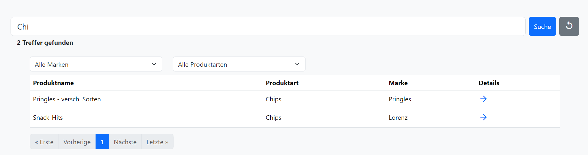
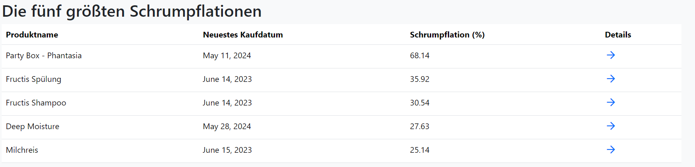
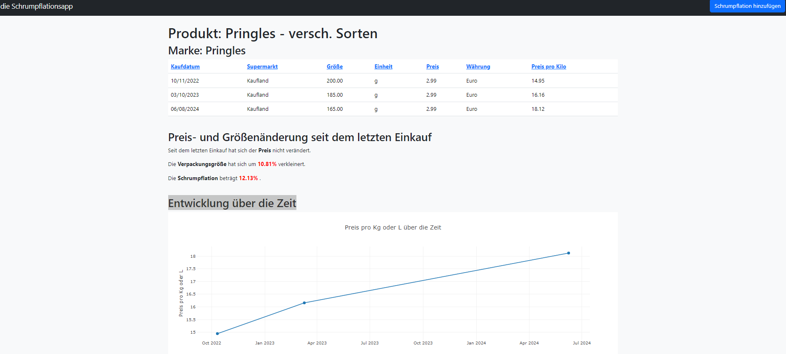
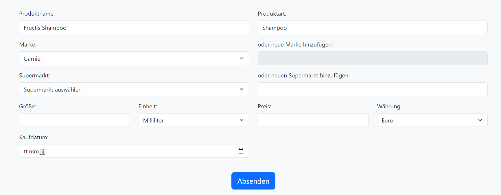

# die Schrumpflationsapp

## So führen Sie das Projekt aus

### Repository klonen
```sh
git clone <repository-url>
cd schrumpflation-app
```

### Virtuelle Umgebung erstellen und aktivieren

```sh
python -m venv venv
```
Windows:
```sh
.\venv\Scripts\activate
```
macOS/Linux:
```sh
source venv/bin/activate
```

### Benötigte Pakete installieren
```sh
pip install -r requirements.txt
```

### Migrationen anwenden
```sh
python manage.py migrate
```

### Datenbank füllen
```sh
python manage.py populate_db
```

### Server starten
```sh
python manage.py runserver
```

### Anwendung aufrufen
Im Webbrowser http://127.0.0.1:8000/ aufrufen


## So bedienen Sie die App

Die Indexseite zeigt ein Suchfeld und eine Tabelle mit allen Einträgen. Schreibt man etwas in das Suchfeld, wird die Datenbank nach allen Producktnamen, Produktarten und Marken durchsucht, die Treffer werden dargestellt und weitere Filter stehen zur Verfügung, um die Ergebnisse weiter zu verfeinern.



Darüberhinaus gibt es eine Tabelle, die die fünf größten Schrumpflationen anzeigt. In beiden Tabellen kommt man zur Detailansicht, indem man auf das Pfeilsymbol klickt.



Die Suche kann man durch Klick auf das "replay" Icon zurücksetzen.

Im Detailview werden tabellarisch Informationen zum Kauf (purchase) des Produkts angezeigt, sowie weitere Informationen zur Preis- und Größenänderung textlich und graphisch dargestellt.

Zur Indexseite kann man immer durch Klick auf den Appnamen "die Schrumpflationsapp" gelangen.



Wenn man auf den Button "Schrumpflation hinzufügen" in der Navbar klickt, kann man Einkäufe (purchase) zu einem bereits bestehenden oder einem neuen Produkt hinzufügen. Möchte man überprüfen, ob ein Produkt bereits existiert, tippt man mindestens zwei Zeichen in das Produktnamen-Feld. Es fungiert als Autocomplete und sucht in der Datenbank nach Übereinstimmungen. Klickt man auf eine der Übereinstimmungen im Dropdown, füllen sich auch automatisch alle Felder, die zum Product (product) gehören, nämlich Produktart, Marke und Einheit.



Möchte man ein neues Produkt (product) und einen dazugehörigen Einkauf (purchase) hinzufügen, muss ein neuer Produktname in das Produktnamen-Feld geschrieben werden. Hat man alle Felder ausgefüllt, kann man das Formular abschicken und entweder ein neuer Einkauf (purchase) wird einem Produkt (product) hinzugefügt oder ein neues Produkt und dazugehöriger Einkauf angelegt.

Sollten nicht alle Felder ausgefüllt worden sein, werden beim Abschicken des Formulars Fehlermeldungen oben als Banner oder direkt unter den Feldern angezeigt.

## Next Steps

- Überarbeitung des Formulars (Userflows besser definieren)
- Überarbeitung des Models (z.B. Handhabung von Mengeneinheiten)
- Benutzerauthentifizierung implementieren, um nachzuverfolgen, wer welche Einkäufe getätigt hat und die Möglichkeit zu geben, Einkäufe upzudaten.
- Ranglisten und Detailansichten für Schrumpflation über bestimmte Zeiträume definieren (z.B. die letzten 3, 5 Jahre).
- Styling überarbeiten, einschließlich responsivem Design für verschiedene Bildschirmgrößen
- Tests implementieren